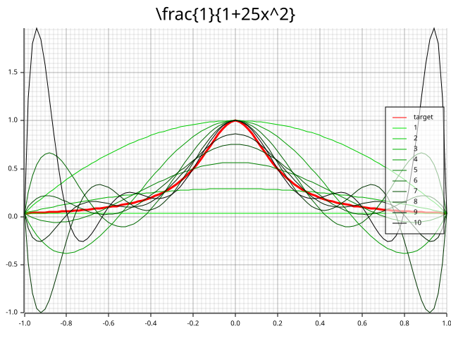
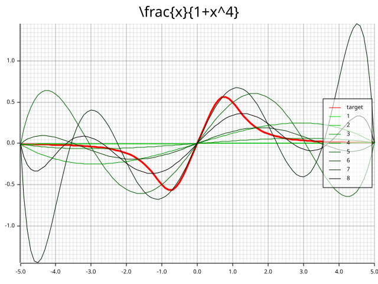
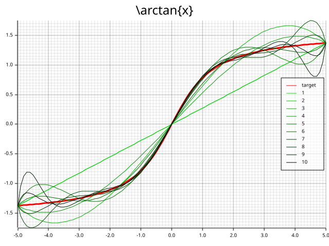
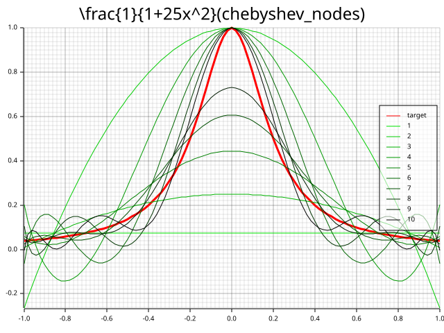
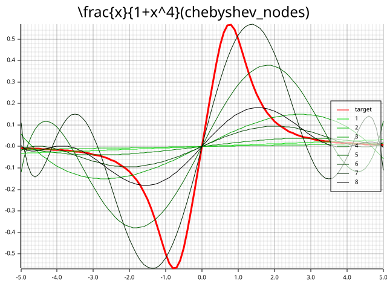
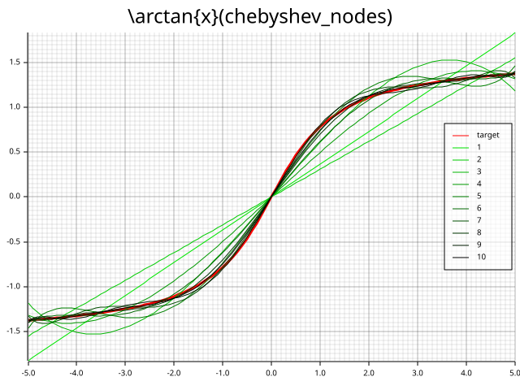
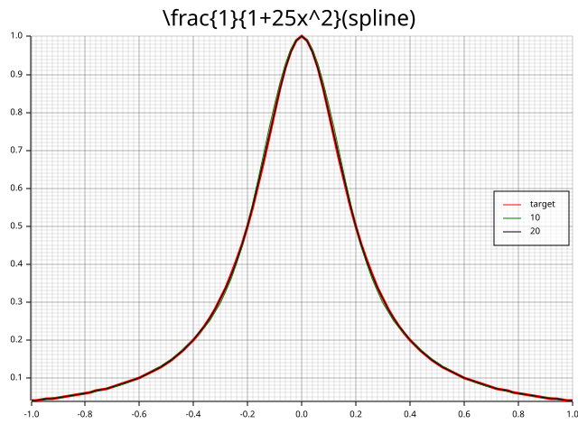
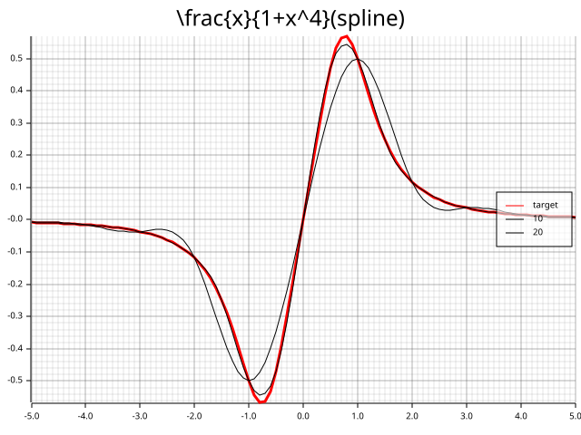
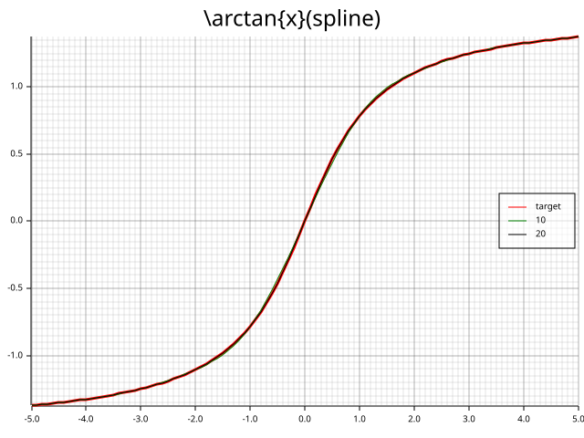
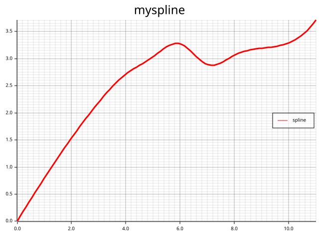

# 说明

采用Rust语言。画图使用[`plotters`](https://docs.rs/plotters/0.3.7/plotters/)，数值分析采用[`peroxide`](https://axect.github.io/Peroxide_Doc/peroxide/index.html)。

## 运行

安装[Rust](https://rust-lang.org/)。

```sh
cargo run
```

即可。


# 实验2.1 多项式插值振荡现象

## 分析

目标函数有三个：
$$
f(x) = \frac{1}{1+25 x^2} \\
h(x) = \frac{x}{1+x^4} \\
g(x) = \arctan{x}
$$
即三个 `Fn(f64) -> f64`，

连续，并且在不同区间上 n 等分，自然，需要的函数签名大概为

```rust
fn lagrange<F, I>(f: F, start: f64, end: f64, ns: I) -> Result<()>
where
    F: Fn(f64) -> f64,
    I: IntoIterator<Item = usize>,
{
    // 求插值多项式
    // 求最值，根据值域初始化网格
    // 画出原函数图像、拉格朗日多项式图像
}
```

规定了定义域的起始点、结束点、以及一个迭代器，yield等分次数。

具体实现见源码。

## 结果

<div style="display: flex; justify-content: space-between; width: 100%;">
    
    
    
<div/>
**分析**： 这些结果均展现了所谓的龙格现象，即当$n \to \infty$时，$L_n(x)$不一定收敛于$f(X)$。并且$\exist c > 0$使得$\left|x\right| \le c$时$\lim_{n\to\infty}{L_n(x) = f(x)}$，而当$\left|x\right| \gt c$时$\lim_{n\to\infty}{L_n(x)}$ 发散。

能够很轻易的观察到，当n比较小时，浅绿色曲线并没有拟合目标函数。当n较大时，可以发现在$x=0$附近的深绿色曲线较好的贴合了目标函数，但是在两端出现较大的波动。

这是因为，当$n\uparrow$时，$R(x) = \dfrac{f^{(n+1)}(\xi)}{(n+1)!}\omega_{n+1}(x)$的变化并不确定。

## 采用切比雪夫点

`peroxide`有切比雪夫点的实现：peroxide::numerical::interp::chebyshev_nodes

1.
$$
f(x) = \frac{1}{1+25 x^2}
$$

<div style="display: flex; justify-content: space-between; width: 100%;">
    
    
<div/>

2.
$$
h(x) = \frac{x}{1+x^4}
$$

<div style="display: flex; justify-content: space-between; width: 100%;">
    
    
<div/>

3.
$$
g(x) = \arctan{x}
$$

<div style="display: flex; justify-content: space-between; width: 100%;">
    
    
<div/>


**分析**： 观察图像，发现选取切比雪夫点进行拉格朗日插值的效果明显好于等距插值。并且，在y轴附近，插值函数似乎收敛于目标函数，在两边，虽依然存在波动，但从例子1与3中，发现已经有了较好的拟合，但2中效果依然不好。

选取切比雪夫点，使得$\omega_{n+1}(x)$项的最大值尽可能小，可能得到更好的$R(X)$。

# 实验2.2 样条插值的收敛性

## 调库作图

(从左到右依次为拉格朗日插值、拉格朗日插值（切比雪夫点）、样条插值（三次自然）)


1.
$$
f(x) = \frac{1}{1+25 x^2}
$$

<div style="display: flex; justify-content: space-between; width: 100%;">
    
    
    
<div/>

2.
$$
h(x) = \frac{x}{1+x^4}
$$

<div style="display: flex; justify-content: space-between; width: 100%;">
    
    
    
<div/>

3.
$$
g(x) = \arctan{x}
$$

<div style="display: flex; justify-content: space-between; width: 100%;">
    
    
    
<div/>
**分析**：三次自然样条插值的结果显著好于拉格朗日插值。并且从2中，可以明显发现，$n\uparrow$，效果越好。

## 自己实现样条插值

### 分析

首先，需要求差分，为了避免每次都传递 $(x, f(x))$ 与$(x, f'(x))$，可采用闭包捕获的编程技巧。

```rust
let divided_difference = move |a: usize, b: usize| {
    if a == b {
        if a == 0 {
            df0
        } else if a == N - 1 {
            dfn
        } else {
            unreachable!()
        }
    } else {
        (fx[a] - fx[b]) / (x[a] - x[b])
    }
};
```

同理，通过捕获$h$来计算$\lambda$，进而计算$\mu$。

各差分计算完成后，可进一步计算$d$，随后可求解$M$。实验要求用追赶法求解线性方程，但是难度较高，源码复用了`peroxide`已有的求解实现。

随后绘图即可。

综上，设计`myspline`的函数签名为

```rust
pub fn myspline<const N: usize>(
    x: [f64; N],
    fx: [f64; N],
    (df0, dfn): (f64, f64),
) -> Result<CubicSpline> {
    todo!()
}

```

具体实现见源码，通过教科书例2.7进行测试，本报告给出的实现求解结果与书上答案相同，认为实现极可能没有问题。

输入实验手册例子后，得到样条曲线如下所示：



# 实验2.3 画手

对于Rust语言，开发一个GUI捕获用户的鼠标输入，是一件极为复杂的事情。得到手轮廓的采样点的坐标后，在之前的基础上绘制样条曲线毫无难度。

在Rust生态中，捕获窗口的鼠标坐标没有现成的实现，自己实现的难度无异于开发一个小游戏，遂放弃。
